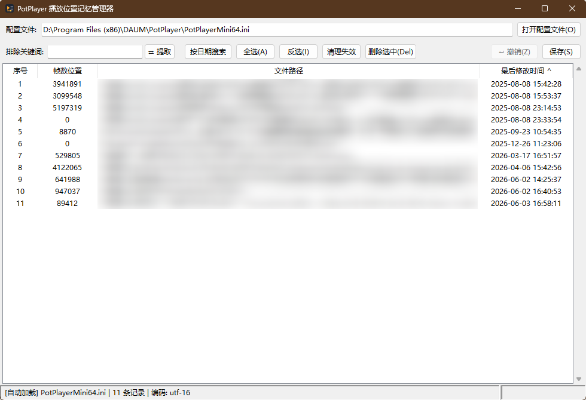

# 🎬 PotPlayer 播放位置记忆管理器

**一个现代化、好用且强大的 PotPlayer 播放记录管理工具**，帮助你轻松管理、筛选和清理视频播放进度记忆。

---

## ✨ 核心特性

- **智能自动加载** — 启动时自动识别并加载 PotPlayer 配置文件
- **双模式过滤** — 支持「排除关键词」与「提取关键词」快速筛选
- **按日期搜索** — 一键找出 7 天 / 30 天 / 90 天 / 180 天前的旧记录
- **失效文件清理** — 智能检测并选中已不存在的文件
- **安全撤销机制** — 支持操作撤销 + 选择状态撤销（最多 5 步）
- **自动备份** — 保存时自动创建带时间戳的备份文件
- **高分屏适配** — 完美支持 Windows 高 DPI 显示

---

## 📸 界面预览

---

## 🚀 下载

**推荐下载**：`PotPlayerHistoryManager.exe`（单文件绿色便携）

---

## 📖 使用指南

### 快速上手
1. 双击运行 `PotPlayerHistoryManager.exe`
2. 程序会**自动**检测并加载当前目录下的 PotPlayer 配置文件
3. 使用关键词过滤想要的记录
4. 点击「按日期搜索」或「清理失效」进行批量管理
5. 修改完成后点击「保存」（自动备份原文件）

### 快捷键
- `Ctrl + O` → 打开配置文件
- `Ctrl + S` → 保存修改
- `Ctrl + Z` → 撤销
- `Ctrl + A` → 全选
- `Ctrl + I` → 反选
- `Delete` → 删除选中记录

---

## 🛠️ 技术特点

- 基于 Python + Tkinter 开发
- 单文件便携，无需安装任何依赖
- 支持 UTF-8 / UTF-16 / GBK / ANSI 等多种编码
- 完善的错误处理与用户友好提示

---

## ❤️ 致谢

感谢 [PotPlayer](https://potplayer.tv/) 这款优秀播放器。

欢迎在 Issues 中提出建议或反馈，一起让这个工具变得更好！

---

**Made with ❤️ for PotPlayer users**
